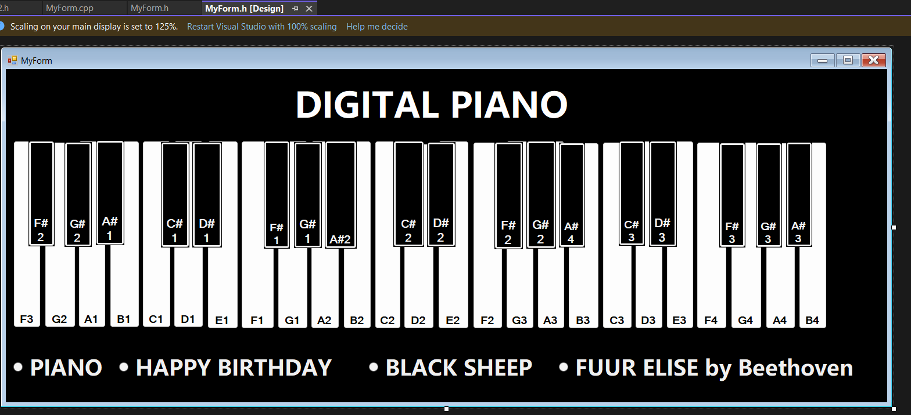

# Digital Piano with GUI

A virtual piano application implemented in C++ with a graphical user interface using Windows Forms. This application allows users to play piano notes through both GUI interactions and keyboard inputs.



## Features

- Interactive piano keyboard interface with white and black keys
- Multiple octaves of piano notes (A1-E3)
- Sound playback using WAV files for authentic piano sounds
- Additional sound generation using system beep functionality
- Multiple sound modes via radio button selection
- Simple and intuitive user interface

## Technology Stack

- C++/CLI
- Windows Forms for GUI
- Visual Studio solution
- System::Media::SoundPlayer for audio playback

## Requirements

- Windows operating system
- Visual Studio 2019 or later
- .NET Framework 4.5 or later

## Installation and Usage

1. Clone the repository:
   ```
   git clone https://github.com/yourusername/DIGITAL-PIANO-WITH-GUI-IMPLEMENTATION-USING-C-.git
   ```

2. Open the solution file:
   ```
   DIGITAL PIANO WITH GUI/Project1/Project1.sln
   ```

3. Build the solution in Visual Studio

4. Run the application

## How to Play

- Click on the piano keys with your mouse to play notes
- Use the radio buttons to switch between different sound modes
- The notes are labeled on the keys (A1, B1, C1, etc.)

## Project Structure

- `MyForm.h` and `MyForm.cpp`: Contains the GUI implementation and event handlers
- `h2.h`: Contains the PlayingKeys class that handles sound playback
- `.wav` files: Sound files for piano notes

## Future Improvements

- Record and playback functionality
- MIDI support
- More instrument sounds
- Customizable key mappings

## License

This project is licensed under the MIT License - see the LICENSE file for details.

## Credits

Developed as a C++ GUI application project with Windows Forms.

## Contributing

Contributions are welcome! Please feel free to submit a Pull Request.
